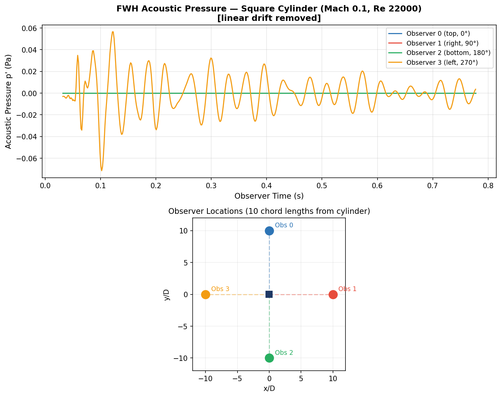

# GSoC 2026 Preparation — SU2 Aeroacoustics & Topology Optimization
Pre-application work for GSoC 2026 with the SU2 multiphysics simulation suite.
This repository documents hands-on work with SU2 v8.4.0, FADO, and SU2PY_FWH
completed before the application period opened.

## Results

### FWH Aeroacoustic Noise Prediction — Square Cylinder (Mach 0.1, Re 22000)

*Acoustic pressure at 4 observer locations (10 chord lengths from cylinder).
Observer 3 (left, 270°) shows periodic vortex shedding signal.
Full pipeline: SU2_CFD → surface VTU → FWH binary → Observer_Noise.dat*

### Topology Optimization — Cantilever Beam

*Cantilever beam, 50% volume fraction, SIMP p=3, Optimality Criteria method.
93% binary topology, volume constraint satisfied at exactly 0.50.*

---

## Pre-Application Work

### Project FWH (SU2PY_FWH)
- Cloned EduardoMolina/SU2PY_FWH and attempted to run on Ubuntu 24 / Python 3.12
- Found and fixed **9 blocking bugs** including Python 2 syntax (24 locations),
  outdated SU2 v7 config key names, incorrect 2D array sizing, and missing input validation
- Wrote `vtu_to_fwh.py`: Python 3 converter from SU2 SURFACE_PARAVIEW output to FWH binary format
- Wrote `write_coords_normals_v2.py`: correct flat-face normals for square cylinder geometry
- Ran end-to-end pipeline: SU2_CFD (500 timesteps) → FWH solver → acoustic observer output
- Full bug documentation: [notes/fwh_study/BUGS_FOUND.md](notes/fwh_study/BUGS_FOUND.md)
- SU2 Discussion: [#2752](https://github.com/su2code/SU2/discussions/2752)

### Project FADO / Topology Optimization
- Built SU2 v8.4.0 from source with full adjoint/AD support (`-Denable-autodiff=true`)
- Ran primal FEA + discrete adjoint (compliance + volume fraction objectives)
- Implemented custom Optimality Criteria optimizer in Python
- Ran FADO optimization framework end-to-end (pcarruscag/FADO)
- Contributed **PR #8** to FADO: [remove deprecated disp option from L-BFGS-B](https://github.com/pcarruscag/FADO/pull/8)
- SU2 Discussions: [#2723](https://github.com/su2code/SU2/discussions/2723), [#2724](https://github.com/su2code/SU2/discussions/2724)

---

## Environment
- SU2 v8.4.0 (built from source, meson + ninja, with CoDiPack autodiff)
- ParaView 5.13.1 (pvpython headless rendering)
- Ubuntu 24.04 (WSL2)
- Python 3.12

## Repository Structure
```
notes/
  fwh_study/          # FWH bug analysis, working scripts, config
  build_instructions.md
  mpi_wsl_fix.md
results/
  fwh_square_cylinder/   # Acoustic pressure output + plot
  topology_optimization/ # Density field visualization
```
